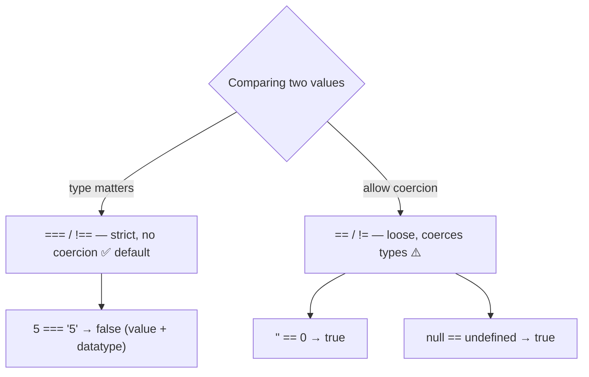
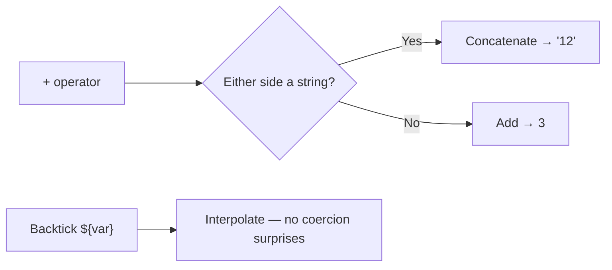
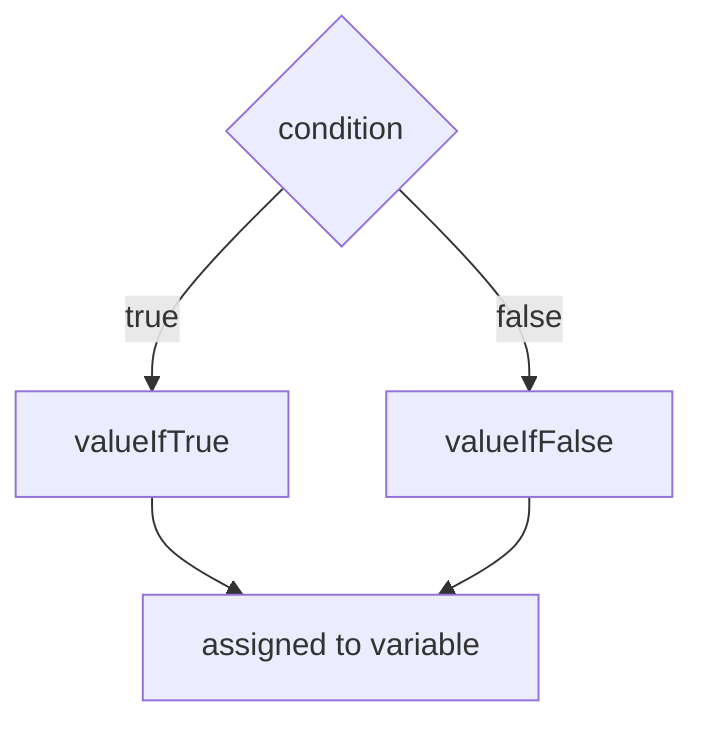
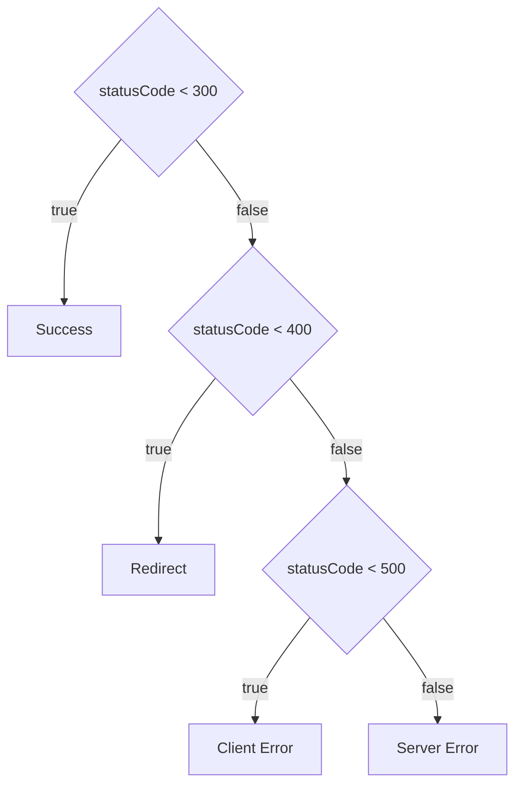
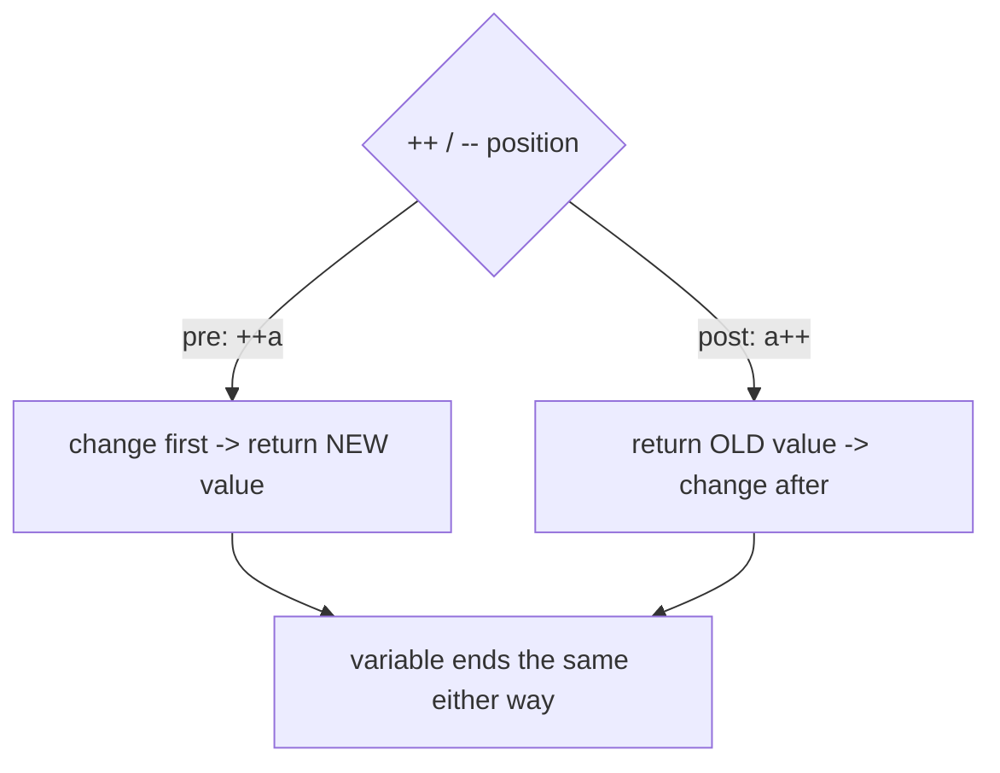
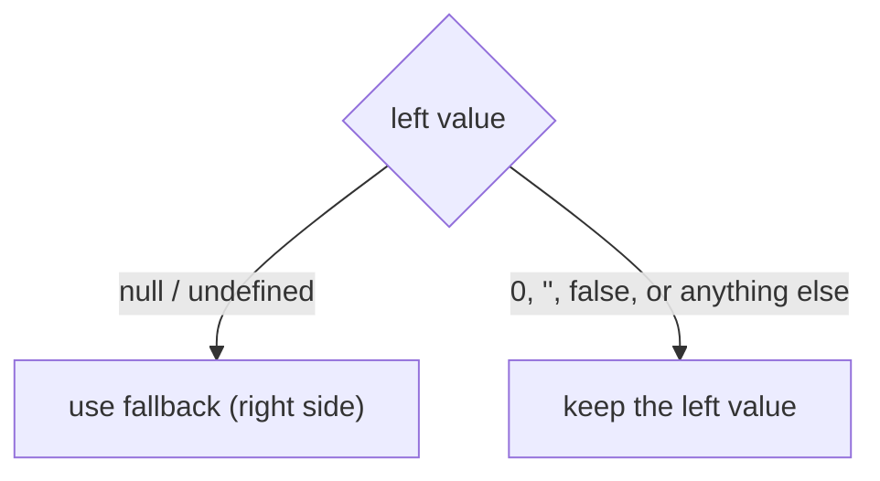
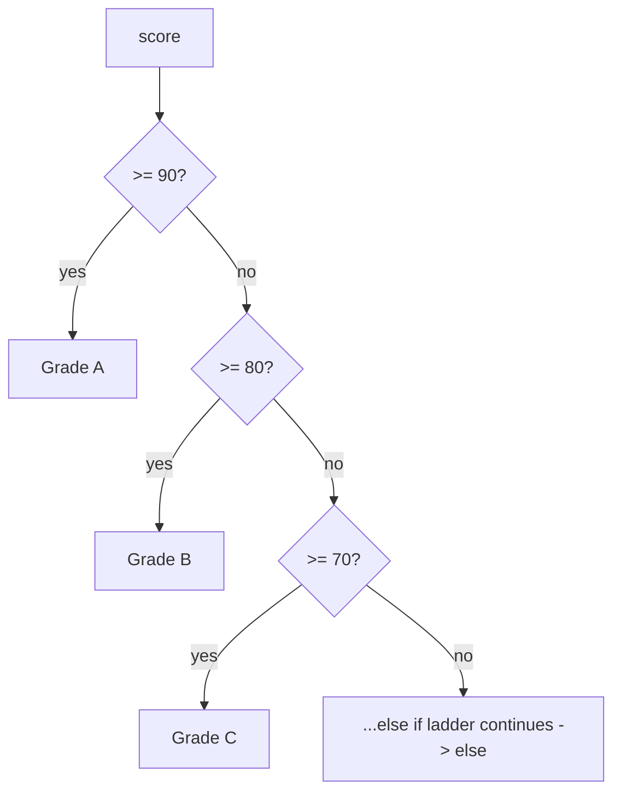

# LearnPlaywright3x — JavaScript Fundamentals & Automation Learning Repo

A learning repository tracking JavaScript fundamentals from first principles, alongside RICE-prompt notes for automation framework generation and a growing `IQ_Notes` reference library (interview-style concept explainers).

---

## Table of Contents

- [Repo Structure](#repo-structure)
- [00 — GenAI / RICE Prompting](#00--genai--rice-prompting)
- [01 — Hello World](#01--hello-world)
- [02 — `let` & Scope](#02--let--scope)
- [03 — Identifiers & Comments](#03--identifiers--comments)
- [04 — Literals & Numbers](#04--literals--numbers)
- [05 — Operators](#05--operators)
  - [05.1 — String Operators & Template Literals](#051--string-operators--template-literals)
  - [05.2 — Ternary (Conditional) Operator](#052--ternary-conditional-operator)
  - [05.3 — Nested Ternary](#053--nested-ternary)
  - [05.4 — Type Operators (`typeof`)](#054--type-operators-typeof)
  - [05.5 Increment and Decrement Operators](#055-increment-and-decrement-operators)
  - [05.6 Nullish Coalescing Operator](#056-nullish-coalescing-operator)
- [06 Statements and Conditionals](#06-statements-and-conditionals)
- [IQ_Notes — Reference Library](#iq_notes--reference-library)

---

## Repo Structure

```
LearnPlaywright3x/
├── 00_chaptet_GENAI/
│   └── RICEPOT_SeleniumFramworkCreation.md   # RICE-style prompt for Selenium framework gen
├── 01_chapter_Javascript/
│   └── 01_HelloWorld.js                      # console.log basics
├── 02_chapter_Javascript/
│   └── 02_let_concept.js                     # let scoping, hoisting, function declarations
├── 03_chapter_Identifier/
│   ├── 03_Identifer_Rules.js                 # valid/invalid identifier characters
│   ├── 04_Identifer_Rues_Part2.js            # naming conventions (camelCase, PascalCase, etc.)
│   ├── 05_Comments.js                        # single-line, multi-line, JSDoc comments
│   └── 06_Identifer_IQ.js                    # identifier edge cases, Unicode, keywords
├── 04_chapter_Literal/
│   ├── 07_Literal.js                         # literal types + typeof
│   ├── 08_null_undefined.js                  # null vs undefined deep dive
│   ├── 09_Null_IQ.js                         # null literal one-liner
│   ├── 10_Literal.js                         # number literal formats (hex, octal, exponent)
│   ├── 11_Number.js                          # integer/float/binary/octal/hex literals
│   └── 12_Number_Part2.js                    # numeric separators, BigInt, Infinity, NaN
├── 05_chapter_Operator/
│   ├── 13_DataType.js                        # the 7 primitive types + array/NaN
│   ├── 14_Assignment_Operator.js             # =, +=, -=, *=, /=, %=
│   ├── 15_Arithmetic_Opeartor.js             # + - * / %, ** exponent, odd/even
│   ├── 16_Comparsion_Operator.js             # ==, ===, !=, !==, >, <, >=, <=
│   ├── 17_Logical_Operators.js               # && || !  (AND / OR / NOT gates)
│   ├── 18_Confusing_Comparsion.js            # "" vs 0 vs "0" coercion, broken transitivity
│   ├── 18_Confusing_Comparsion_P2.js         # null/undefined equality gotchas
│   ├── 20_Question.js                        # != vs !== practice
│   ├── 21_String_Op.js                       # string concat with + and +=, console.log multi-arg
│   ├── 22_Ternary_Op.js                      # condition ? valueIfTrue : valueIfFalse
│   ├── 23_IQ.js                              # ternary → PASS/FAIL assertion result
│   ├── 24_IQ2.js                             # ternary → env-based baseUrl switch
│   ├── 25_IQ3.js                             # ternary → CI headless vs headed
│   ├── 26_IQ4.js                             # ternary → SLA check + template literals
│   ├── 27_IQ5.js                             # ternary returning booleans (anti-pattern)
│   ├── 28_Nested_Terny_Op.js                 # nested ternary — age → drink check
│   ├── 29_IQ_NT.js                           # nested ternary — HTTP status category
│   ├── 30_NT_IQ2.js                          # nested ternary — temperature bands
│   ├── 31_Type_Op.js                         # typeof on string/number/array/null
│   ├── 32_In_De_Op.js                        # pre vs post increment (++a vs a++)
│   ├── 33_Ad_Incre.js                        # increment inside an expression
│   ├── 34_Incre_Part2.js                     # post-increment return value vs variable
│   ├── 35_Decrement.js                       # pre vs post decrement (--a vs a--)
│   └── 36_Null_Coalescing.js                 # nullish coalescing ?? (null/undefined fallback)
├── 06_chapter_Statement/
│   ├── 37_IQ.js                              # if / else -> age gate
│   ├── 38_IQ2.js                             # nested if -> drink-age check
│   └── 38_Multiple_Condition.js              # else-if ladder -> score to grade
└── IQ_Notes/
    ├── README.md                             # reusable prompt template for new IQ notes
    ├── Source_Code_ByteCODE_Binary_IQ.md      # source vs bytecode vs machine code
    ├── 01_Identifier_Rules.md                 # identifier rules reference
    ├── 02_Keyword_Notes.md                    # all JS reserved keywords by category
    ├── 03_commands_mac.md                     # VS Code shortcuts — macOS
    └── 03_commands_win.md                     # VS Code shortcuts — Windows
```

---

### 00 — GenAI / RICE Prompting

**Concept:** `RICEPOT_SeleniumFramworkCreation.md` is a structured prompt (Role, Instructions, Context, Example, Parameters, Output, Tone) for asking an LLM to generate an enterprise-grade Selenium + Java + Maven + TestNG framework.

**Why:** Structured prompting (RICE/RICEPOT) produces more consistent, production-quality code from an LLM than a one-line ask — it constrains scope, style, and output format up front.

**Q&A — why use this?**
- **Q: What does the prompt enforce?** A: Page Object Model with `PageFactory`, XPath-only locators, no `Thread.sleep()`, no comments in generated code, TestNG annotations.
- **Q: What target app does it automate?** A: `login.salesforce.com` — valid and invalid login test cases.
- **Q: Why ban CSS/ID selectors?** A: The prompt is testing strict XPath-only locator discipline as an enterprise standard, not a technical limitation.

```
R — Role: 15-year QA automation expert
I — Instructions: Page Object Model + PageFactory, XPath only, TestNG, no Thread.sleep()
C — Context: Salesforce login page (email, password, submit, remember-me)
E — Example: sample PageFactory class structure
P — Parameters: enterprise-grade, zero bad practice
O — Output: 1 Page Object + 2 TestNG scripts + Maven project, code-only
T — Tone: technical, precise, enterprise-grade
```

---

### 01 — Hello World

**Concept:** The smallest possible JS program — printing to the console.

**Why:** Establishes the run loop (`node file.js` → V8 → stdout) before anything else.

**Q&A — why use this?**
- **Q: What runs this file?** A: Node.js, powered by the V8 engine.
- **Q: Where does `console.log` write to?** A: stdout, via V8's console binding.
- **Q: Why start here?** A: Confirms the toolchain (Node install, file execution) works before adding logic.

```js
console.log("Hello The Testing Academy!");
```

---

### 02 — `let` & Scope

**Concept:** `let` is block-scoped, unlike `var` which is function-scoped. This file also shows hoisting behavior for function declarations.

**Why:** Understanding block scope is required before writing loops or conditionals safely — `var` in a loop leaks past the block, `let` doesn't.

**Q&A — why use this?**
- **Q: Why does `badCodeFn()` work even though it's called before its declaration?** A: Function declarations are hoisted fully (name + body) to the top of their scope.
- **Q: What would break if `let a` inside the `for` were `var a`?** A: Nothing here directly, but `var` would leak `a` out of the loop's block scope into the enclosing scope.
- **Q: Why is this file called "bad code"?** A: A 100,000-iteration `console.log` + function call per tick is a deliberate anti-pattern for demonstrating performance cost, not a real-world pattern.

```js
let a = 10;
console.log(a);

for (let a = 0; a < 100000; a++) {
    console.log(a);
    badCodeFn();
}

function badCodeFn() {
    console.log("Hello");
}
```

---

### 03 — Identifiers & Comments

**Concept:** Covers legal identifier characters, naming conventions, comment syntax, and edge cases like Unicode identifiers and reserved keywords.

**Why:** Naming rules are enforced by the parser before your code ever runs — knowing the boundaries avoids `SyntaxError`s and keeps code readable across a team.

**Q&A — why use this?**
- **Q: Can an identifier start with a digit?** A: No — `let 1stPlace` throws `SyntaxError: Invalid or unexpected token`.
- **Q: Can Unicode be used in identifiers?** A: Yes — `let café` and `let 变量` are both valid; so are `\uXXXX` escape sequences.
- **Q: What's the difference between `/* */` and `/** */` comments?** A: Both are multi-line block comments to the engine; `/** */` is the JSDoc convention used by tooling (IDEs, doc generators) to extract structured documentation.

```js
let validName = "starts with letter";
let _private = "starts with underscore";
let $jquery = "starts with dollar sign";
let café = "Unicode letter é";
let 变量 = "Chinese characters";

// let 1stPlace = "invalid"; // SyntaxError
// let class = "invalid";    // reserved keyword

/**
 *  JSDoc-style comment
 *  Author : Pramod Dutta
 */
var g = 10; // cmd + /, ctrl + /
```

Full identifier rules + naming convention tables live in [`IQ_Notes/01_Identifier_Rules.md`](IQ_Notes/01_Identifier_Rules.md).

---

### 04 — Literals & Numbers

**Concept:** A literal is a fixed value written directly in source code (`42`, `"hi"`, `true`, `null`). This chapter covers every literal type, `typeof` behavior, `null` vs `undefined`, and every JS number format (decimal, binary, octal, hex, exponential, separators, BigInt, `Infinity`/`NaN`).

**Why:** JS has exactly one `number` type (IEEE 754 double) for everything except `BigInt` — no `int`/`float`/`double` split like Java or C. Knowing the literal forms and quirks (`typeof null === "object"`, `NaN !== NaN`) prevents subtle bugs.

**Q&A — why use this?**
- **Q: Why does `typeof null` return `"object"`?** A: A long-standing JS bug from the original 1995 implementation, kept for backward compatibility.
- **Q: What's the real difference between `null` and `undefined`?** A: `undefined` means "not assigned yet" (JS sets it automatically); `null` means "intentionally empty" (a developer sets it explicitly).
- **Q: When do you need `BigInt`?** A: When an integer exceeds `Number.MAX_SAFE_INTEGER` (2^53 - 1) and precision matters — append `n` to the literal or call `BigInt(...)`.

```js
// Number formats
let decimal = 42;
let binary  = 0b1010;      // 10
let octal   = 0o52;        // 42
let hex     = 0x2A;        // 42
let exp     = 1.5e3;       // 1500
let million = 1_000_000;   // numeric separator (ES2021+)
let big     = 123456789012345678901234567890n; // BigInt

// null vs undefined
let userName;              // undefined — not yet assigned
let profilePicture = null; // null — intentionally empty
console.log(typeof userName);       // "undefined"
console.log(typeof profilePicture); // "object" (quirk)

// Special numeric values
console.log(1 / 0);        // Infinity
console.log(0 / 0);        // NaN
console.log(typeof NaN);   // "number" (quirk)
```

---

### 05 — Operators

**Concept:** Operators are the symbols that act on values — assignment (`=`, `+=`), arithmetic (`+ - * / % **`), comparison (`== === != !== > <`), and logical gates (`&& || !`). This chapter also nails down JS's 7 primitive data types and the coercion quirks that make `==` dangerous.

**Why:** Every condition, loop guard, and assertion you'll ever write in a Playwright test is built from these operators — and loose `==` coercion is the #1 source of silent bugs (`"" == 0` is `true`, `null >= 0` is `true`). Knowing when to reach for `===` is non-negotiable.

**Q&A — why use this?**
- **Q: Why prefer `===` over `==`?** A: `==` coerces types before comparing (`5 == "5"` → `true`), `===` checks value **and** type (`5 === "5"` → `false`). Use `===` by default; `==` only for the deliberate `x == null` null-or-undefined check.
- **Q: What does `%` (modulus) buy me?** A: The remainder — the classic even/odd test is `n % 2 === 0` (even) vs `n % 2 === 1` (odd).
- **Q: What's the `null >= 0` gotcha?** A: `>=` coerces `null` to `0`, so `null >= 0` is `true`, yet `null == 0` is `false` and `null > 0` is `false` — relational and equality operators use different coercion rules.



```js
// Assignment shorthands
let x = 10;
x += 5;   // 15
x *= 2;   // 30
x %= 4;   // 2   (remainder)

// Arithmetic — modulus & exponent
console.log(101 % 2);   // 1  → odd
console.log(2 ** 3);    // 8  → 2 to the power 3

// Comparison: loose vs strict
console.log(5 == "5");   // true  → == coerces "5" to 5
console.log(5 === "5");  // false → === checks value AND type

// Logical gates
let a = true, b = false;
console.log(a && b);     // false → AND
console.log(a || b);     // true  → OR
console.log(!a);         // false → NOT

// Coercion traps (why === wins)
console.log("" == 0);    // true  😬
console.log(null >= 0);  // true  🤯
console.log(null == 0);  // false
```

| Operator | Coerces types? | Use when |
|----------|:--------------:|----------|
| `===` / `!==` | No | Default — almost always |
| `==` / `!=` | Yes | Only the intentional `x == null` check |

---

#### 05.1 — String Operators & Template Literals

**Concept:** `+` doubles as string concatenation, `+=` appends in place, and backtick template literals interpolate values with `${...}`. `console.log` also accepts multiple comma-separated arguments and prints them space-separated.

**Why:** Test logs, dynamic URLs, and assertion messages are all built by joining strings — template literals do it without the `+ " " +` noise.

**Q&A — why use this?**
- **Q: When do I use a template literal over `+`?** A: Any time a variable sits inside a sentence — `` `Response: ${ms}ms` `` beats `"Response: " + ms + "ms"` for readability, and it supports multi-line strings.
- **Q: What's the difference between `console.log("a", b)` and `console.log("a" + b)`?** A: The comma form passes separate arguments (space-inserted, each formatted by type); `+` coerces `b` to a string and joins with no space.
- **Q: What's the gotcha with `+`?** A: It's overloaded — `1 + 2` is `3`, but `1 + "2"` is `"12"`. One string operand turns the whole thing into concatenation.



```js
let s = "Hi, ";
console.log(typeof s);       // "string"
s += "Dev";
console.log(s);              // "Hi, Dev"

console.log("Hello" + "World");        // "HelloWorld"  → concatenation
console.log("HELLO", "Prrammod");      // "HELLO Prrammod" → multi-arg, space added
console.log(1, 2, 3, 4, "Hello", true);

// Template literal
let sla = 1000;
console.log(`What is the SLA time ? - ${sla}`);
```

---

#### 05.2 — Ternary (Conditional) Operator

**Concept:** `condition ? valueIfTrue : valueIfFalse` — the only JS operator taking three operands. It's an *expression*, so it returns a value you can assign directly.

**Why:** Picking one of two values (headless vs headed, staging vs prod URL, PASS vs FAIL) is a one-liner instead of a four-line `if/else` that has to declare the variable first.

**Q&A — why use this?**
- **Q: When do I reach for it?** A: When you need a **value**, not a branch of logic — config switches, status labels, short assertion messages.
- **Q: What does it replace?** A: A pre-declared `let x;` followed by `if (cond) { x = a } else { x = b }`.
- **Q: What's the gotcha?** A: `cond ? true : false` is redundant — the condition is already a boolean, so just use `cond` (see `27_IQ5.js`). Also, don't use a ternary for side effects; use `if`.



```js
// Basic form: condition ? value(if true) : value(if false)
let age = 20;
let canGo = age > 18 ? "Yes" : "No";
console.log("This person can go goa ? ", canGo);

// Assertion result
let actualStatusCode = 200, expectedStatusCode = 200;
console.log(actualStatusCode === expectedStatusCode ? "✅ PASS" : "❌ FAIL");

// Environment switch
let environment = "staging";
let baseUrl = environment === "prod"
    ? "https://api.example.com"
    : "https://staging-api.example.com";

// CI-aware browser mode
let isCI = true;
console.log("Launching browser in:", isCI ? "headless" : "headed", "mode");

// SLA check + template literal
let responseTime = 850, sla = 1000;
console.log(`Response: ${responseTime}ms — ${responseTime <= sla ? "Within SLA ✅" : "SLA breached ❌"}`);
```

---

#### 05.3 — Nested Ternary

**Concept:** A ternary whose `false` branch is another ternary, chaining several conditions into one expression — the readable form is a flat `a ? x : b ? y : z` ladder, one condition per line.

**Why:** Mapping a value onto 3+ buckets (HTTP status → category, temperature → feel) reads as a clean lookup ladder instead of a stack of `else if` blocks.

**Q&A — why use this?**
- **Q: How do I keep it readable?** A: Chain flat, not inward — put each `cond ? result :` on its own line and let the final `else` value sit last. Order matters: conditions are evaluated top-down, first match wins.
- **Q: When should I NOT nest?** A: Past ~4 branches, or when branches do anything besides return a value — switch to `if/else` or an object lookup map.
- **Q: What's the gotcha?** A: Deep inward nesting (`a ? (b ? x : y) : z`) gets unreadable fast, and a wrong condition order silently produces the wrong bucket — `statusCode < 500` before `statusCode < 400` would label every redirect a client error.



```js
// Inward nesting — works, but harder to read
let age = 26;
let enjoy = age > 18 ? (age > 26 ? "Drink" : "No") : false;
console.log(`Can pramod Drink? : ${enjoy}`);

// Flat ladder — preferred. First match wins, so order matters.
let statusCode = 404;
let category =
    statusCode < 300 ? "Success" :
    statusCode < 400 ? "Redirect" :
    statusCode < 500 ? "Client Error" : "Server Error";
console.log(`Status ${statusCode}: ${category}`);

let temp = 35;
let feel = (temp >= 40) ? "Very Hot" :
           (temp >= 30) ? "Hot" :
           (temp >= 20) ? "Warm" :
           (temp >= 10) ? "Cool" : "Cold";
console.log("Temperature:", temp, "| Feel:", feel);
```

---

#### 05.4 — Type Operators (`typeof`)

**Concept:** `typeof` is a unary operator returning the type of a value as a lowercase string — `"string"`, `"number"`, `"boolean"`, `"undefined"`, `"object"`, `"function"`, `"bigint"`, `"symbol"`.

**Why:** JS is dynamically typed, so a variable's type is only knowable at runtime — `typeof` is the runtime guard before you trust a value's shape.

**Q&A — why use this?**
- **Q: Why do `123` and `31.4` both report `"number"`?** A: JS has one numeric type (IEEE 754 double) — no `int`/`float` split.
- **Q: Why is `typeof []` `"object"`?** A: Arrays *are* objects. `typeof` can't distinguish them — use `Array.isArray([])` instead.
- **Q: What's the gotcha?** A: `typeof null === "object"` (the 1995 bug kept for compatibility). To check for null, compare directly: `x === null`.

```mermaid
flowchart TD
    T["typeof x"] --> P{primitive?}
    P -->|string/number/boolean| Exact["exact type string ✅"]
    P -->|null| Bug["'object' ⚠️ use x === null"]
    P -->|array| Arr["'object' ⚠️ use Array.isArray&#40;x&#41;"]
```



```js
console.log(typeof "hello");   // "string"
console.log(typeof 123);       // "number"  (int → number)
console.log(typeof 31.4);      // "number"  (float → number)
console.log(typeof true);      // "boolean"
console.log(typeof undefined); // "undefined"
console.log(typeof null);      // "object"  ← quirk
console.log(typeof []);        // "object"  ← use Array.isArray([])
```

| Check | Wrong way | Right way |
|-------|-----------|-----------|
| Is it null? | `typeof x === "null"` (never true) | `x === null` |
| Is it an array? | `typeof x === "array"` (never true) | `Array.isArray(x)` |

---

#### 05.5 Increment and Decrement Operators

**Concept:** `++` adds 1, `--` subtracts 1. Position matters: **pre** (`++a`) changes the variable *then* returns the new value; **post** (`a++`) returns the *old* value first, then changes the variable.

**Why:** The pre/post distinction is the classic JS interview trap and a real bug source, `let b = a++` leaves `b` holding the old value while `a` has already moved on.

**Q&A — why use this?**
- **Q: What's the difference between `++a` and `a++`?** A: `++a` increments then hands back the updated value; `a++` hands back the current value then increments. Same effect on `a`, different value returned to the expression.
- **Q: Why does `let b = a++` surprise people?** A: `a++` returns `a`'s value *before* the bump, so `b` gets the old number even though `a` is now one higher.
- **Q: What's the gotcha in expressions?** A: Mixing `++a + a++` in one line is evaluation-order dependent and unreadable, keep increments on their own statement in real code.



```js
// Post-increment: b gets the OLD value, a moves on
let a = 10;
let b = a++;
console.log(b);   // 10  (value before the bump)
console.log(a);   // 11

// Post-decrement mirrors it
let c = 10;
let d = c--;
console.log(d);   // 10
console.log(c);   // 9
```

---

#### 05.6 Nullish Coalescing Operator

**Concept:** `??` returns its right-hand fallback only when the left side is `null` or `undefined`. Any other value (including `0`, `""`, `false`) passes through unchanged.

**Why:** It's the safe default operator for API responses and config, `||` would wrongly replace legit falsy values like `0` or `""`, `??` only fires on genuinely missing data.

**Q&A — why use this?**
- **Q: When do I reach for it?** A: Supplying a default for a value that might be missing, `let data = apiResponse ?? "{}"`.
- **Q: How is it different from `||`?** A: `||` triggers on *any* falsy value (`0`, `""`, `false`, `null`, `undefined`); `??` triggers ONLY on `null`/`undefined`, so `0 ?? 5` is `0` but `0 || 5` is `5`.
- **Q: What's the gotcha?** A: Don't mix `??` with `&&`/`||` without parentheses, JS throws a `SyntaxError` unless you group them explicitly.



```js
let amul = null;
let val = amul ?? "NANDANI Milk";
console.log(val);            // "NANDANI Milk"  (null -> fallback)

let apiResponse = null;
console.log(apiResponse ?? "{}");   // "{}"  (missing -> fallback)

let name = "Pramod";
console.log(name ?? "{}");   // "Pramod"  (present -> kept)
```

| Left value | `left \|\| right` | `left ?? right` |
|------------|:----------------:|:---------------:|
| `null` / `undefined` | right | right |
| `0` / `""` / `false` | right | **left kept** |

---

### 06 Statements and Conditionals

**Concept:** `if / else if / else` is JS's core branching statement, it runs a block only when its condition is truthy. Blocks can nest (an `if` inside an `if`) and chain into an `else if` ladder that tests conditions top-down, first match wins.

**Why:** Every test skip, environment guard, and pass/fail branch in a Playwright suite is an `if`. Unlike the ternary operator (which returns a value), a statement runs *logic*, multiple lines, side effects, nested checks.

**Q&A — why use this?**
- **Q: When do I use `if` over a ternary?** A: When a branch does more than pick a value, logging, multiple statements, nested conditions, or side effects. Ternary is for values, `if` is for logic.
- **Q: How does an `else if` ladder evaluate?** A: Top to bottom, the first condition that is truthy runs and the rest are skipped, so order the ranges correctly (`>= 90` before `>= 80`).
- **Q: What's the gotcha with nested `if`?** A: An inner `else` binds to the nearest `if`, mis-indentation hides which condition it actually pairs with. Keep braces explicit.



```js
// else-if ladder: first truthy branch wins, so order matters
let score = 78;

if (score >= 90) {
    console.log("Grade: A — Excellent");
} else if (score >= 80) {
    console.log("Grade: B — Good");
} else if (score >= 70) {
    console.log("Grade: C — Can do better");
} else if (score >= 60) {
    console.log("Grade: D — Needs Improvement");
} else {
    console.log("Bring parents");
}

// Nested if: inner check only runs when the outer passes
let age = 27;
if (age > 18) {
    console.log("GOA");
    if (age > 26) console.log("DRINK!");
    else console.log("You CAN'T DRINK!");
} else {
    console.log("No GOA");
}
```

| Construct | Returns a value? | Use for |
|-----------|:----------------:|---------|
| Ternary `? :` | Yes | Picking one of two values |
| `if / else` | No | Branching logic, side effects, nesting |

---

## IQ_Notes — Reference Library

Concept explainers, generated on demand via the prompt template in [`IQ_Notes/README.md`](IQ_Notes/README.md) — table breakdown, code walkthrough, pipeline diagram, TL;DR.

| File | Covers |
|------|--------|
| [`Source_Code_ByteCODE_Binary_IQ.md`](IQ_Notes/Source_Code_ByteCODE_Binary_IQ.md) | Source code vs bytecode vs binary/machine code, V8 compilation pipeline |
| [`01_Identifier_Rules.md`](IQ_Notes/01_Identifier_Rules.md) | Legal identifier characters, case sensitivity, naming conventions |
| [`02_Keyword_Notes.md`](IQ_Notes/02_Keyword_Notes.md) | Every JS reserved keyword, grouped by category |
| [`03_commands_mac.md`](IQ_Notes/03_commands_mac.md) | VS Code keyboard shortcuts — macOS |
| [`03_commands_win.md`](IQ_Notes/03_commands_win.md) | VS Code keyboard shortcuts — Windows |

---

> **TL;DR:** This repo is a from-scratch JavaScript fundamentals course (`console.log` → scoping → identifiers → literals/numbers → operators → statements/conditionals) plus a `00_chaptet_GENAI` folder for LLM automation-framework prompting, backed by an `IQ_Notes` library of standalone concept references anyone can regenerate with the same prompt template.
